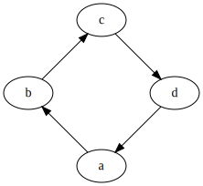

# node-graphviz

A JS + WASM module for compiling graphs written in DOT to images, using GraphViz in Node.js.

No annoying native build system or native dependencies that need to be compiled.

## Installation

```
npm install JosephusPaye/node-graphviz --save
```

## Usage

See [The DOT Language](https://graphviz.gitlab.io/_pages/doc/info/lang.html) for more information about DOT, and [GraphViz Pocket Reference](https://graphs.grevian.org/example) for some examples.

```js
const fs = require('fs');
const { graphviz } = require('node-graphviz');

// Define a graph using DOT notation
const graph = `
    digraph {
        a -> b;
        b -> c;
        c -> d;
        d -> a;
    }
`;

// Compile the graph to SVG using the `dot` layout algorithm
graphviz.circo(graph, 'svg').then((svg) => {
  // Write the SVG to file
  fs.writeFileSync('graph.svg', svg);
});
```

Running the above produces the following SVG:



## API

The module exports the following API:

```ts
declare type Format = 'svg' | 'dot' | 'json' | 'dot_json' | 'xdot_json';

declare type Engine = 'circo' | 'dot' | 'fdp' | 'neato' | 'osage' | 'patchwork' | 'twopi';

export declare const graphviz = {
    layout(dotSource: string, outputFormat?: Format, layoutEngine?: Engine): Promise<string>;
    circo(dotSource: string, outputFormat?: Format): Promise<string>;
    dot(dotSource: string, outputFormat?: Format): Promise<string>;
    fdp(dotSource: string, outputFormat?: Format): Promise<string>;
    neato(dotSource: string, outputFormat?: Format): Promise<string>;
    osage(dotSource: string, outputFormat?: Format): Promise<string>;
    patchwork(dotSource: string, outputFormat?: Format): Promise<string>;
    twopi(dotSource: string, outputFormat?: Format): Promise<string>;
};
```

### graphviz.layout(_dotSource_[, _outputFormat_][, _layoutengine_])

Performs layout for the supplied `dotSource`.

Where:

- `outputFormat` is one of (see [Output Formats](https://graphviz.gitlab.io/_pages/doc/info/output.html) for details):
  - `dot`
  - `dot_json`
  - `json`
  - `svg` (default)
  - `xdot_json`
- `layoutEngine` is one of (see [Layout documentation](https://www.graphviz.org/documentation/) for details):
  - `circo`
  - `dot` (default)
  - `fdp`
  - `neato`
  - `osage`
  - `patchwork`
  - `twopi`

### graphviz.circo(_dotSource_[, _outputFormat_])

Convenience function that performs **circo** layout, is equivalent to `layout(dotSource, outputFormat, 'circo')`.

### graphviz.dot(_dotSource_[, _outputFormat_])

Convenience function that performs **dot** layout, is equivalent to `layout(dotSource, outputFormat, 'dot')`.

### graphviz.fdp(_dotSource_[, _outputFormat_])

Convenience function that performs **circo** layout, is equivalent to `layout(dotSource, outputFormat, 'fdp')`.

### graphviz.neato(_dotSource_[, _outputFormat_])

Convenience function that performs **neato** layout, is equivalent to `layout(dotSource, outputFormat, 'neato')`.

### graphviz.osage(_dotSource_[, _outputFormat_])

Convenience function that performs **osage** layout, is equivalent to `layout(dotSource, outputFormat, 'osage')`.

### graphviz.patchwork(_dotSource_[, _outputFormat_])

Convenience function that performs **patchwork** layout, is equivalent to `layout(dotSource, outputFormat, 'patchwork')`.

### graphviz.twopi(_dotSource_[, _outputFormat_])

Convenience function that performs **twopi** layout, is equivalent to `layout(dotSource, outputFormat, 'twopi')`.

## Credits

This module is based on [hpcc-systems/hpcc-js-wasm](https://github.com/hpcc-systems/hpcc-js-wasm), which is designed for use in a browser, not Node.js. The following changes were made to support Node and simplify the module to include only GraphViz:

- Rewrote WASM binary location and fetching to read from the filesystem
- Added the compiled [WASM binary](https://unpkg.com/browse/@hpcc-js/wasm@0.3.14/dist/) to the source
- Reduced the JS code by half to include only GraphViz, removed Expat and other unrelated code
- Removed build system and TypeScript, in favor of a single source file (based on the compiled dist file from [hpcc-systems/hpcc-js-wasm](https://github.com/hpcc-systems/hpcc-js-wasm))

## Licence

[MIT](LICENSE)
